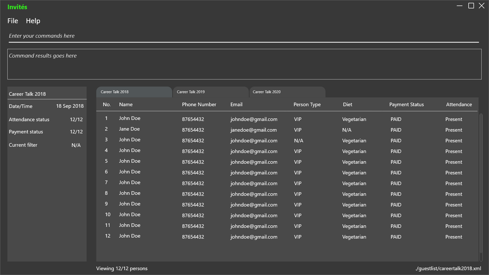

# Invités
ifdef::env-github,env-browser[:relfileprefix: docs/]

https://travis-ci.org/CS2113-AY1819S1-F09-3/main[image:https://travis-ci.org/CS2113-AY1819S1-F09-3/main.svg?branch=master[Build Status]]
https://ci.appveyor.com/project/aaryamNUS/main[image:https://ci.appveyor.com/api/projects/status/bdt6xr7o98ea332r?svg=true[Build status]]
https://coveralls.io/github/CS2113-AY1819S1-F09-3/main?branch=master[image:https://coveralls.io/repos/github/CS2113-AY1819S1-F09-3/main/badge.svg?branch=master[Coverage Status]]
https://gitter.im/se-edu/Lobby[image:https://badges.gitter.im/se-edu/Lobby.svg[Gitter chat]]
https://cs2113-ay1819s1-f09-3.github.io/main/[image:https://img.shields.io/badge/Documentation-Online-green.svg[Documentation Link]]

ifdef::env-github[]

endif::[]

ifndef::env-github[]
image::images/Ui.png[width="600"]
endif::[]

Invités is a web application that caters to organisers of different events (such as weddings, orientation camps, networking sessions, product launches, etc). It helps event planners reduce their workload during the planning phase by providing them
a convenient platform to manage guest lists, organise catering services, as well as keep track of payments. Our main target audience are event managers and planners, who wish to utilise a streamlined and efficient approach towards organising their
events. The application also caters to nearly every type of event specialising by providing customised themes for different events.

## Our Purpose
To streamline, digitise, and revamp the process of managing events, and benefit both the guests and the planners by doing so.

### Features:
The following list highlights the main features our application provides, ranging from mass messaging to all guests to payment and dietary tracking.

###### _General_

1. Side tab, where event planners will be able to see what events they are planning.

###### __For each event __

1. *Overarching detail fields*

    a. Name of event

    b. Date and Time of event

    c. Venue of event

    d. Dress code for event

    e. Number of guests so far

2. *Table of details of guests*

    a. Name of guest

    b. Mobile number of guest

    c. Email address of guest

    d. Dietary Requirement of guest

    e. Ticket number of guest for mass attendance-marking

    f. Status of guest (e.g. VIP)

    g. Status of Payment of guest (e.g. PAID)

## Acknowledgements
Some parts of this application were adapted from the sample application: https://github.com/se-edu/[Address Book Level 4] by *_SE-EDU_*.

#### Libraries used: https://github.com/TestFX/TestFX[TextFX], https://bitbucket.org/controlsfx/controlsfx/[ControlsFX], https://github.com/FasterXML/jackson[Jackson], https://github.com/google/guava[Guava], https://github.com/junit-team/junit5[JUnit5]
### Licence : link:LICENSE[MIT]
